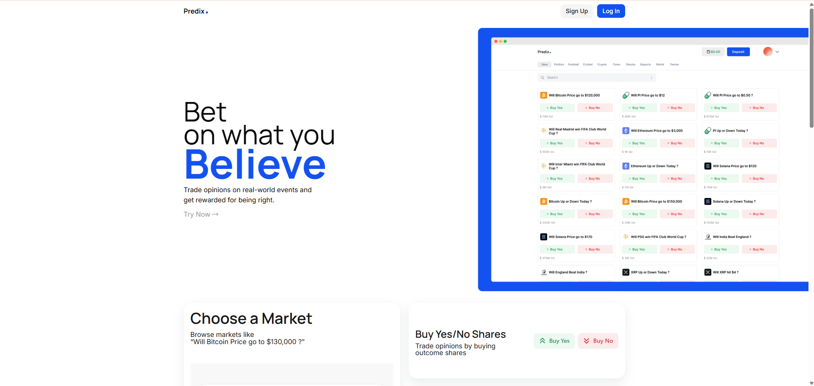
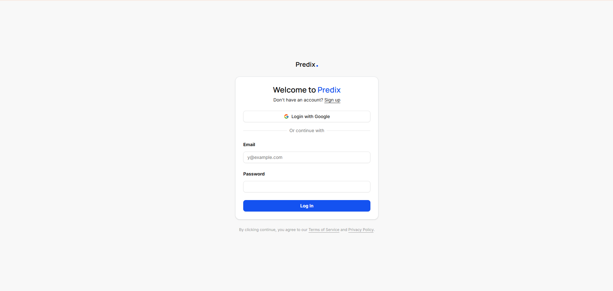
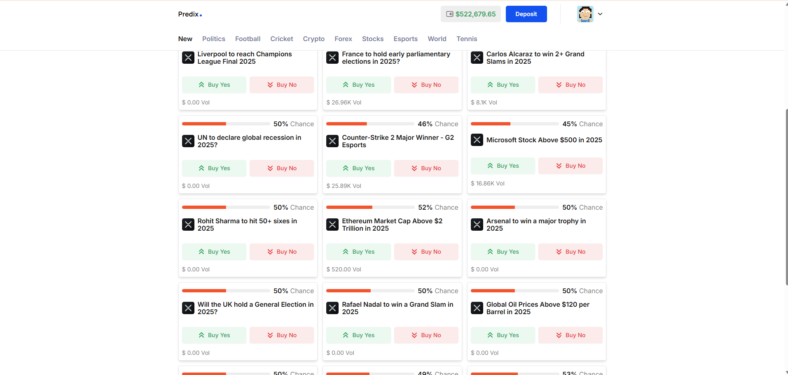
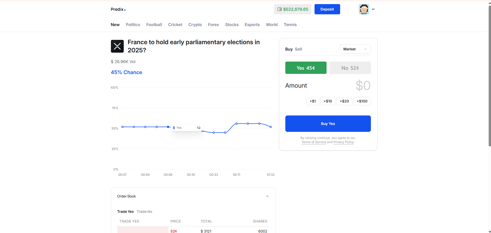
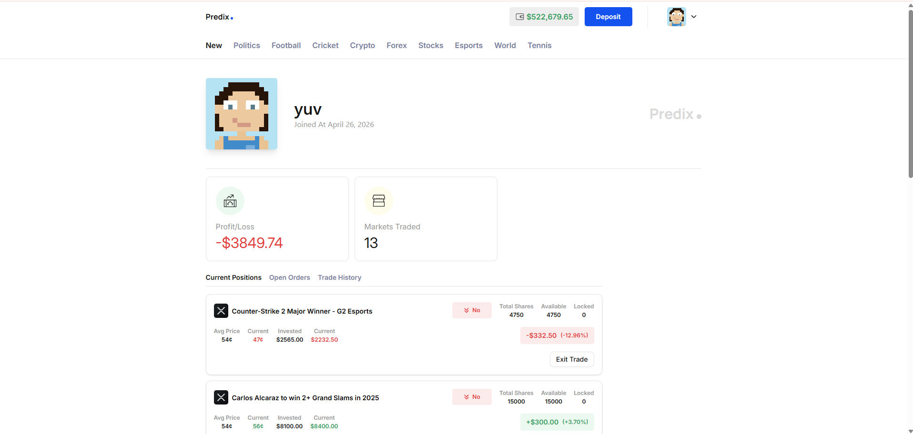
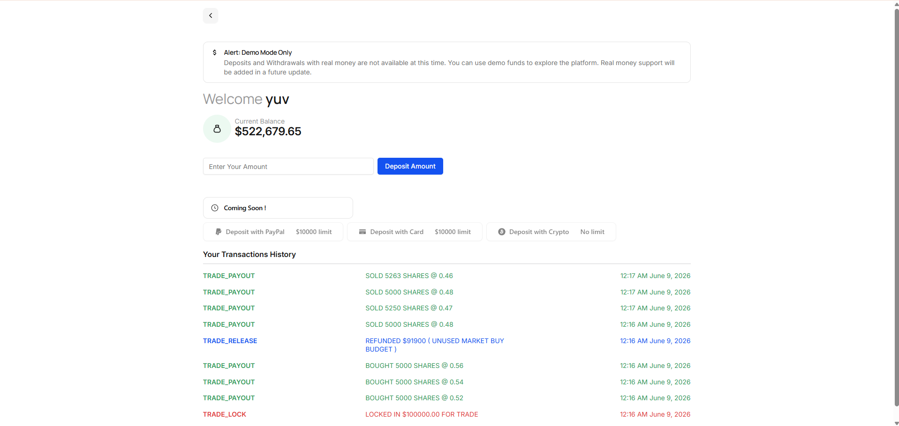

# Predix — Real-Time Prediction Market Platform

## Overview

Predix is a full-stack real-time prediction market platform where users can trade YES/NO outcomes on event-based markets. It supports market orders, limit orders, live orderbooks, demo wallet funds, portfolio tracking, and real-time market updates.

The project combines a React/Vite frontend, an Express/TypeScript backend, Prisma/PostgreSQL persistence, Redis-backed orderbook infrastructure, Socket.IO streaming, and a worker-based matching engine to simulate exchange-like behavior in a demo environment.

## Live Demo Note

The hosted demo runs on free-tier infrastructure, so first requests, orderbook loading, and trade settlement may take a few seconds.

For stability on free hosting, the continuous liquidity-provider workers are disabled in the live demo. Instead, demo liquidity is pre-seeded into the orderbook. The full worker-based matching engine and liquidity-provider architecture are included in the repository and can run locally or on stronger infrastructure.

## Project Screenshots

Below are selected screens from the Predix web application.

### Landing Page



### Login



### Home / Market Discovery



### Market Trading Page



### Portfolio / Profile



### Demo Wallet / Deposit



## Key Highlights

- Real-time YES/NO prediction markets
- Market and limit order support
- Redis-backed orderbook and market depth state
- Worker-based matching engine for trade execution
- Queue-based asynchronous order processing
- Liquidity provider worker for demo market depth
- Demo wallet and simulated deposits
- Portfolio views for current positions, open orders, trade history, and PnL
- Exit trade flow for closing visible positions
- Passport.js local and Google authentication
- Backend auth middleware for protected user-specific routes
- Socket.IO updates for wallet, market, orderbook, trade, and comment events
- Prisma + PostgreSQL persistence
- React/Vite user frontend
- Separate admin app workspace for in-progress market management workflows

## Why Predix Is More Than a CRUD App

Predix goes beyond standard create/read/update/delete workflows by modeling core pieces of a trading system. User orders are validated, funds or holdings are locked, orders are routed through Redis-backed queues, and worker processes execute matching logic asynchronously.

The backend handles wallet settlement, holdings updates, order state transitions, partial fills, order cancellation, and real-time market data publishing. Redis supports fast orderbook operations and live event distribution, while Socket.IO keeps the frontend responsive as trades and market depth change.

## Features

### Trading

- View active prediction markets
- Buy and sell YES and NO outcome shares
- Place market orders
- Place limit orders
- Cancel open limit orders
- Support for partial fills
- View orderbook depth
- Execute trades through a backend matching engine
- Exit visible positions through the trade interface
- View market chart data and recent trade activity

### Wallet and Portfolio

- Demo wallet for simulated funds
- Demo deposits
- Transaction history
- Wallet balance and locked funds tracking
- Current positions
- Open orders
- Trade history
- PnL and current value display
- Live wallet refresh after trading events

### Real-Time Infrastructure

- Redis-backed orderbook and depth state
- Redis queues for order routing and worker processing
- Redis streams for market data events
- Redis pub/sub for wallet and liquidity events
- Socket.IO namespaces for live wallet, market, trade, and comment updates
- Matching worker for asynchronous trade execution
- Liquidity provider worker for prototype/demo market depth

### Authentication

- Local signup and login
- Google authentication
- Passport.js session-based auth
- Protected frontend routes
- Backend middleware for authenticated and user-specific endpoints
- Ownership checks for protected wallet, portfolio, and order actions

### Admin / Market Management

- Separate admin React/Vite app is present in the `admin/` folder
- Admin dashboard shell with placeholder stats for users, markets, markets ending today, and pending resolutions
- Market list and market-detail modal use local dummy market data
- Create-market form includes local validation and preview state
- Resolve-market screen includes confirmation UI for YES, NO, and cancel actions
- Admin form actions currently run locally and log values instead of calling backend APIs

## Admin App

Predix includes a separate admin application inside the `admin/` folder. It is intended for administrative workflows such as market review, market creation, and market resolution, but it is currently under active development and should be treated as an in-progress prototype rather than a complete production-ready admin panel.

The current admin app is a React/Vite/Tailwind CSS workspace with React Router routes for the dashboard, all markets, create market, resolve market, and login screens. The market list and resolve views currently use local dummy data, dashboard stats are placeholders, and login/create/resolve actions validate or confirm in the UI before logging locally. Some functionality may be incomplete or not fully connected yet.

The admin panel is not the primary user-facing trading app. The main trading experience remains in the `frontend/` app.

## Tech Stack

| Category | Technologies |
| --- | --- |
| Frontend | React, Vite, Tailwind CSS, Redux Toolkit, React Redux, React Router, Axios, Socket.IO Client, Recharts, Radix UI, Lucide React, Sonner |
| Backend | Node.js, Express, TypeScript, Zod |
| Database | PostgreSQL |
| Real-time / Queue | Redis, ioredis, Socket.IO, Redis queues, Redis streams, Redis pub/sub |
| Auth | Passport.js, Passport Local, Google OAuth, Express Session, bcrypt |
| ORM | Prisma ORM |
| Admin | React, Vite, Tailwind CSS, React Router DOM |
| Tooling | Git, npm, TypeScript, ESLint, environment-based configuration |

## Architecture Overview

1. A user places a trade from the frontend.
2. The backend validates authentication, user ownership, wallet balance, holdings, and order data.
3. BUY orders lock wallet funds.
4. SELL orders lock holdings.
5. The order is created in PostgreSQL and pushed to a Redis-backed queue.
6. A router assigns the order to a worker responsible for that market.
7. The matching engine processes the order against the opposite side of the orderbook.
8. Settlement updates wallet balances, holdings, order status, and trade records in PostgreSQL using Prisma.
9. Redis streams and pub/sub publish market and wallet events.
10. Socket.IO pushes updates back to the frontend.

This keeps request handling, matching, settlement, and real-time broadcasting separated at a high level while still supporting a responsive trading experience.

## Order Execution Flow

BUY orders use wallet funds. When a BUY order is placed, the backend validates the wallet balance and locks the required amount before the order enters the matching pipeline.

SELL orders use holdings. When a SELL order is placed, the backend validates that the user owns enough shares of the selected outcome and locks those shares before execution.

Market orders execute against available liquidity immediately. Limit orders can rest on the orderbook when they are not fully filled. The matching engine handles fills, partial fills, order status updates, wallet settlement, holdings settlement, trade creation, and live market data updates. Portfolio views reflect the resulting holdings, open orders, and executed trades.

## Redis Usage

Redis powers the low-latency trading layer:

- Fast orderbook state management
- Market depth reads and updates
- Queue-based order routing
- Worker-based order processing
- Stream-based market data updates
- Pub/sub events for wallet updates and liquidity provider triggers

No Redis credentials or production connection details are included in this README.

## Liquidity Provider Worker

Predix includes a liquidity provider worker for demo-mode liquidity. It monitors assigned markets, maintains orderbook depth, places and cancels demo liquidity orders, and helps markets remain tradeable during local demos or prototype usage.

This component is intended for simulation and product demonstration. It should not be treated as financial-grade market making.

## Security and Auth

Predix uses Passport.js with session-based authentication. User-specific backend routes are protected by auth middleware, and frontend protected routes prevent unauthenticated users from accessing private pages.

Secrets and service connection strings are expected to be configured through environment variables. Placeholder `.env.example` files are safe to commit, while real `.env` files should remain ignored and private.

Predix is currently a demo-mode platform. Simulated deposits and demo balances are supported, but real-money financial operations are not enabled.

## Environment Variables

Use placeholder values only. Do not commit real credentials.

Backend environment example:

```env
DATABASE_URL="YOUR_DATABASE_URL"
GOOGLE_CLIENT_ID="YOUR_GOOGLE_CLIENT_ID"
GOOGLE_CLIENT_SECRET="YOUR_GOOGLE_CLIENT_SECRET"
FRONTEND_URL="YOUR_FRONTEND_URL"
REDIS_CLIENT="YOUR_REDIS_CLIENT_URL"
```

Frontend environment example:

```env
VITE_BACKEND_URL="YOUR_BACKEND_URL"
```

## Installation and Setup

### 1. Clone the Repository

```bash
git clone <YOUR_REPOSITORY_URL>
cd Predix
```

### 2. Backend Setup

```bash
cd backend
npm install
```

Configure the backend environment variables in a local `.env` file using placeholder names from `.env.example`.

Generate the Prisma client and apply migrations:

```bash
npx prisma generate
npx prisma migrate dev
```

Start PostgreSQL and Redis before running the backend.

Start the API server:

```bash
npm run dev
```

Start the matching engine in a separate terminal:

```bash
cd backend
npm run engine
```

If your local setup supports running both together:

```bash
cd backend
npm run dev:all
```

Build the backend:

```bash
npm run build
```

Run the compiled backend:

```bash
npm start
```

### 3. Frontend Setup

```bash
cd frontend
npm install
```

Configure the frontend environment variables in a local `.env` file.

Start the frontend:

```bash
npm run dev
```

Build the frontend:

```bash
npm run build
```

Preview the production build:

```bash
npm run preview
```

### 4. Admin App Setup

The admin app runs as a separate Vite workspace and is currently in progress.

```bash
cd admin
npm install
```

Start the admin app:

```bash
npm run dev
```

Build the admin app:

```bash
npm run build
```

Preview the admin production build:

```bash
npm run preview
```

## Demo Mode Notice

Predix uses simulated/demo funds. Real-money deposits, withdrawals, and production financial operations are not enabled.

This project is intended for learning, demos, portfolio presentation, and product prototype use.
